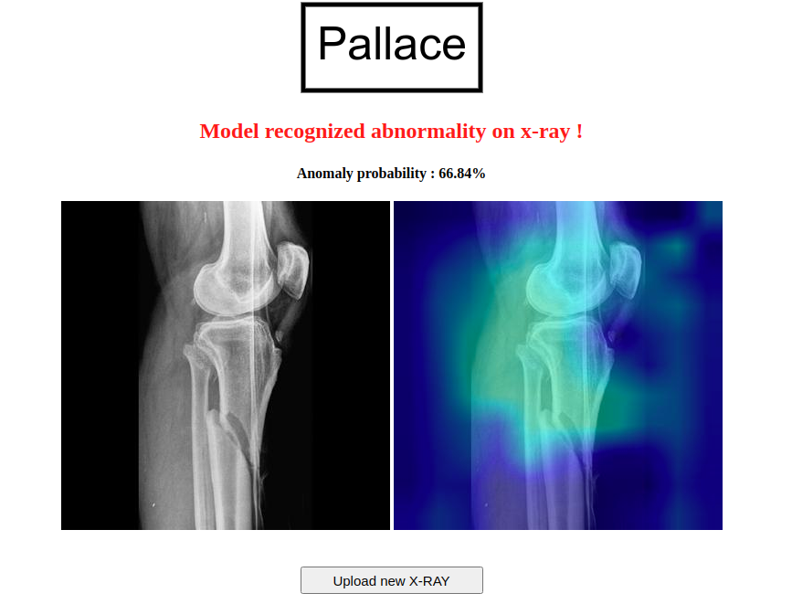
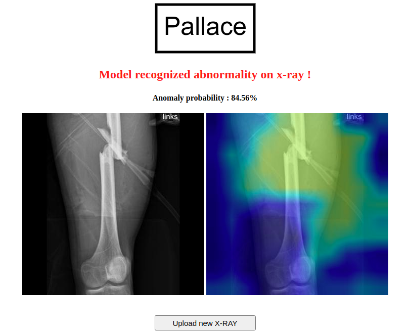

# Project Title
Pallace is the RnD project aimed to build the system for the complicated bone fractures detection. This part of the project dedicated to the abnormalities detection on the musculoskeletal radiographs on MURA and LERA datasets.
MURA and LERA (musculoskeletal radiographs) are large datasets of bone X-rays. Algorithms are tasked with determining whether an X-ray study is normal or abnormal.
# Motivation
Our goal is to achive the result close to the human-level persofrmance and then to incorporate the solution into the daily practise of the radiologists to help reduce the human bias errors and help to overcome the timing challenges that practical specialists face when examing the radiographs. 
# Environment
Technical stack:
PyTorch, OpenCV, Flask.
You should use requirements.txt or conda_requirements.txt (better for Conda environment) file to create environment for this app.

# Data
On the first stage of the project to train the model MURA and LERA dtatasets were used. Beside this, we also used the clinical radiographs from the Germany clinics labeled by the practical specialists (average years of experience of the specialists 10 years).
# Data augmentation:
* Random horizontal flip
* Random rotation up to 30 degrees
* Scale randomly in the range 95-130%
* Randomly change brightness in the range 80-120%

# Results
Prediction over study using 4 densenet-169 models ensemble:
* Cohen’s kappa statistic : 0.720 
* AUC ROC score : 0.870 
* Accuracy : 0.863

| Type | Kappa score |
| ------ | ------ |
| Elbow   | 0.715 |
| Finger   | 0.395 |
| Forearm   | 0.730 |
| Hand   | 0.862 |
| Numerus   | 0.602 |
| Shoulder   | 0.735 |
| Wrist   | 0.942 |

# Screenshots

